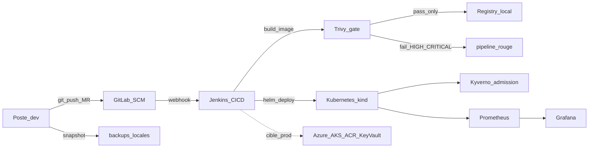

# Architecture

## Vue d’ensemble

Ce lab implémente un pipeline DevSecOps en deux niveaux :

1. **Lab local** — exécutable sur une machine de démo (Docker + kind)
2. **Cible production** — même pipeline, runtime Azure (AKS / ACR / Key Vault)

## Composants

| Couche | Composant | Emplacement |
|--------|-----------|-------------|
| App | Spring Boot + Gradle | `apps/demo-api/` |
| SCM | GitLab.com (remote) | — |
| CI/CD | Jenkins + Jenkinsfile | `jenkins/` |
| Config lab | Ansible + Vault | `ansible/` |
| Runtime | kind + Helm | `helm/demo-api/`, `k8s/` |
| Policies | Kyverno + PSS + NetPol | `security/policies/kyverno/` |
| Observabilité | Prometheus + Grafana | `monitoring/` |
| Backup | PowerShell + git bundle | `backup/` |
| Cloud cible | Terraform Azure | `terraform/azure/` |

## Flux CI/CD (Jenkins)

1. Checkout  
2. Gitleaks (secrets)  
3. Semgrep (SAST)  
4. Trivy filesystem (SCA)  
5. Gradle build + tests  
6. Docker build **local** (tag `sha-<git>`)  
7. **Trivy image** — fail HIGH/CRITICAL → **pas de push**  
8. SBOM (Syft CycloneDX)  
9. Checkov (IaC)  
10. Push registry  
11. Helm deploy `demo-dev`  
12. Kyverno valide / refuse le pod  

## Lab vs production

| Aspect | Lab | Production (documentée) |
|--------|-----|-------------------------|
| Registry | `localhost:5000` | Azure Container Registry |
| Cluster | kind | AKS |
| Secrets | Ansible Vault → K8s Secret | Azure Key Vault |
| IaC runtime | Ansible + Helm | Terraform + Helm |

## Décisions

- **Un outil = un rôle** : Jenkins pour la CI, pas GitLab CI en parallèle.
- **Scan-then-push** : Trivy tourne sur l’image locale avant tout `docker push`.
- **Deux filets runtime** : PSS (admission K8s) + Kyverno (policies métier).
- **Azure optionnel** : le lab tourne en local sans coût cloud ; Terraform Azure reste documenté.
