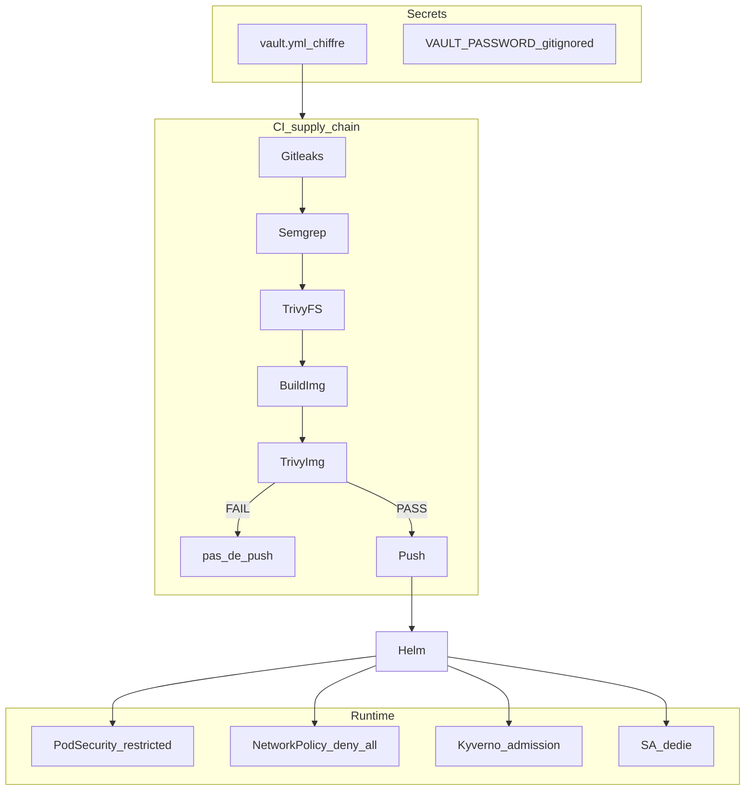

# Sécurité — défense en profondeur

Trois couches : **secrets** → **supply chain / CI** → **runtime Kubernetes**.



## 1. Secrets — Ansible Vault

| Règle | Détail |
|-------|--------|
| Fichier chiffré | `ansible/group_vars/all/vault.yml` |
| Template public | `vault.yml.example` (clés vides) |
| Mot de passe Vault | `~/.ansible-vault-devsecops` — **gitignored** |
| Secrets K8s | Générés au deploy (Helm), jamais de Secret YAML en clair |
| `.gitignore` | `.env`, `*.vault-pass`, `kubeconfig`, `backups/` |

```powershell
ansible-vault encrypt ansible\group_vars\all\vault.yml `
  --vault-password-file "$env:USERPROFILE\.ansible-vault-devsecops"

ansible-vault view ansible\group_vars\all\vault.yml `
  --vault-password-file "$env:USERPROFILE\.ansible-vault-devsecops"
```

## 2. Supply chain — gate avant push

| Stage | Outil | Seuil |
|-------|-------|-------|
| Secrets | Gitleaks | Fail si secret trouvé |
| SAST | Semgrep | Fail sur findings error |
| SCA | Trivy fs | Fail HIGH/CRITICAL |
| Image | Trivy image | Fail HIGH/CRITICAL **avant push** |
| IaC | Checkov | Fail sur FAILED |
| SBOM | Syft | Artefact CycloneDX archivé |

Configuration : `security/trivy.yaml`, `security/checkov.yaml`, `security/semgrep.yaml`, `security/gitleaks.toml`.

**Dockerfile durci** (`apps/demo-api/Dockerfile`) :

- Base image pinnée par digest  
- Multi-stage  
- `USER` non-root  
- Pas de secrets dans les layers  
- Pas de tag `:latest` pour le déploiement  

## 3. Runtime Kubernetes

Namespace `demo-dev` :

| Contrôle | Implémentation |
|----------|----------------|
| Pod Security | `pod-security.kubernetes.io/enforce=restricted` |
| NetworkPolicy | Deny-all + allow DNS / scrape / app |
| Kyverno | Policies : non-root, readOnlyRootFilesystem, no privileged, no `:latest`, registry allowlist, resources obligatoires |
| RBAC | ServiceAccount `demo-api`, least privilege |
| Resources | LimitRange + ResourceQuota |

Policies : `security/policies/kyverno/`.

## Politique d’acceptation des risques

Les exceptions Trivy doivent être documentées dans `security/trivy.yaml` avec justification (CVE, raison, date de revue).

## Hors scope v1

HashiCorp Vault, Cosign/sigstore, DAST ZAP, SonarQube — points d’extension documentés pour une v2.
